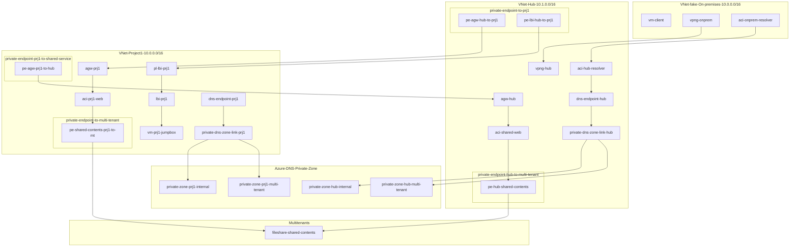

# Sample pattern for connecting VNets and On-premises with Private Link Service

## Problem statement

* Want to assign many IP addresses to new applications created on Azure, e.g. Containers
* Want to freely design the network according to new technologies and services
* On the other hand, need to connect to On-premisess or shared services on other virtual networks in Azure
* With conventional methods such as peering, the number of IP addresses is insufficient or overlapped

## Candidate solution

* [NAT on VPN Gateway](https://docs.microsoft.com/en-us/azure/vpn-gateway/nat-overview)
  * Limitation: NAT for VNet-to-VNet connection is [not supported](https://docs.microsoft.com/en-us/azure/vpn-gateway/nat-overview#nat-limitations)
* [Private Link Service](https://docs.microsoft.com/en-us/azure/private-link/private-link-service-overview)
  * Limitation: [Supported only for VM/VMSS](https://docs.microsoft.com/en-us/azure/private-link/private-link-service-overview#limitations)

## Solution

* Connect VNets (expose endpoints) with [Private Link Service](https://docs.microsoft.com/en-us/azure/private-link/private-link-overview)
  * For VM/VMSS with Azure LB
  * For HTTP(s) with [Application Gateway](https://docs.microsoft.com/en-us/azure/application-gateway/private-link) (New! private preview as of June 2022)
* Expose multi-tenant managed services with [Private Endpoint](https://docs.microsoft.com/en-us/azure/private-link/private-endpoint-overview)

VNet for projects are able to have the same address space as others and On-premises! You got freedom.

## Overview of sample

### Key components

* (Fake)On-premises VNet
  * Client VM
  * DNS Resolver container (zone forwarder for Hub VNet linked DNS)
  * VPN Gateway to Hub VNet (ER is also OK)
* Hub VNet
  * VPN Gateway to On-premise VNet
  * DNS Resolver container (Alternative: [Azure DNS Privete Resolver](https://docs.microsoft.com/en-us/azure/dns/dns-private-resolver-overview))
  * Linked private DNS zone
    * For shared service: internal.poc
    * For multi tenant managed service: privatelink.file.core.windows.net
  * Shared Web service container (with TLS self-signed)
  * Private Link Service to shared web service with Application Gateway
  * Private Endpoint to Project VNet
    * for ssh to jumpbox VM
    * for project web service
* Project VNet
  * Jumpbox VM
  * Project web service
  * rivate Link Service to projct web service with Application Gateway
  * Private Endpoint to Hub VNet
    * for shared web service
  * Private Endpoint to multi tenant managed service
  * Linked private DNS zone
    * For shared service: internal.poc
    * For multi tenant managed service: privatelink.file.core.windows.net
* Multi tenant managed service
  * Shared contents on Azure Storage file share

### Diagram



## Use cases

### On-premises client to shared web on Hub Vnet

```shell
myname@mytenant@vm-client:~$ curl https://shared-web.internal.poc --insecure
Hello from shared-web
myname@mytenant@vm-client:~$ curl https://shared-web.internal.poc/shared/shared.html --insecure
This is shared content.
```

* Name resolution: OK
* Shared contents via Private Endpoint: OK

### On-premises client to project web on Project Vnet

```shell
myname@mytenant@vm-client:~$ curl http://10.1.0.6
Hello from project1-web
myname@mytenant@vm-client:~$ curl http://10.1.0.6/shared/shared.html
This is shared content.
```

* Reachability: OK
* Shared contents via Private Endpoint: OK

### SSH from On-premises client to jumpbox VM on Project VNet

```shell
myname@mytenant@vm-client:~$ az ssh vm --ip 10.1.0.5
Welcome to Ubuntu 20.04.4 LTS (GNU/Linux 5.13.0-1025-azure x86_64)
[snip]
```

* Reachability: OK
* [SSH with Azure AD auth](https://docs.microsoft.com/en-us/azure/active-directory/fundamentals/auth-ssh)(no need to manage cert/key and local account): OK

### Jumpbox VM to Project web on the same VNet

```shell
myname@mytenant@vm-jumpbox:~$ curl http://10.0.16.4
Hello from project1-web
myname@mytenant@vm-jumpbox:~$ curl http://10.0.16.4/shared/shared.html
This is shared content.
```

* Reachability: OK
* Shared contents via Private Endpoint: OK

### Jumpbox VM on Project VNet to shared web on Hub VNet

```shell
myname@mytenant@vm-jumpbox:~$ curl https://shared-web.internal.poc --insecure
Hello from shared-web
```

* Reachability: OK

## Considerations

* Scalability of Private Link Service
  * Private Link has [limits](https://docs.microsoft.com/en-us/azure/private-link/private-link-faq#how-can-i-scale-my-private-link-service--) on the number that can be configured, e.g. 8 IPs per Private Link Service.
  * You may need to increase Private Link Service on the number of projects
* Outbound traffic control on Project VNet
  * Simple: One Azure Firewall per Project VNet
  * Shared: Share one Azure Firewall with multiple projects
    * Need peering, so lose the freedom of network design (trade-off!)
* Resouce grouping, ownership and permissions
  * There are resources such as endpoints that are difficult to decide whether to put in a shared group or a project.
  * Consider the onwership and delegation of work when the project increases and during operation
